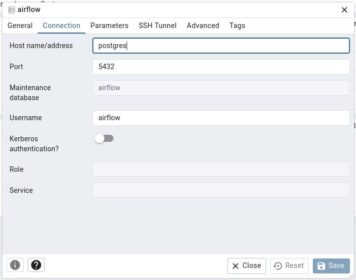

# ETL Pipeline with Airflow and Docker Compose

## Prerequisites

Ensure you have the following tools installed:

- Docker and Docker Compose
- GNU make (optional, to simplify command execution)

## Setup Instructions

### 1. Clone the Repository

```bash
git clone https://github.com/CaoKha/simple-etl-airflow.git
cd simple-etl-airflow
```

### 2. Start the services

Use the following make command to start Airflow and its dependencies:

```bash
make start
```

This will:

- Build the necessary Docker images.
- Start services like the Airflow scheduler, webserver, worker, Redis, and Postgres.

### 3. Access the Airflow UI

- Open a web browser and navigate to `http://localhost:8080`
- Use the default Airflow credentials:
  - Username: airflow
  - Password: airflow

## Available Commands

You can use the following make commands to manage your ETL pipeline.

### 1. Start Services

Start all Airflow and related services (builds images if needed):

```bash
make start
```

### 2. Stop Services

Stop and remove all running containers:

```bash
make stop
```

### 3. View Logs

Follow logs for all running containers:

```bash
make logs
```

### 4. Run a Backfill

Trigger a backfill to process historical data for the simple_etl_pipeline DAG:

```bash
make backfill
```

This command runs a backfill for the date range 2024-12-16 to 2024-12-17. 5. Clean Output Files

### 5. Clean Output Files

Remove generated ETL output files:

```bash
make clean
```

This will clear files in:

- data/json_data/
- data/html_data/

### 6. Rebuild Services

Rebuild all services from scratch, including volumes:

```bash
make rebuild
```

### 7. Remove All Services

Clean up all services and volumes:

```bash
make docker-clean
```

## Workflow

1. Start the Pipeline:

- Run `make start` to spin up all services.

2. Monitor Airflow UI:

- Visit <http://localhost:8080> and monitor the DAGs.
- Trigger the DAG manually or wait for its scheduled run.

3. Backfill Historical Data:

- Run `make backfill` to execute the DAG for historical dates.

4. Clean Output Files:

- Use `make clean` to remove intermediate and output data.

5. Stop Services:

- Use `make stop` when finished.

6. Rebuild (Optional):

- If services need to be recreated, use `make rebuild`.

7. Remove All Services:

- If you want to clean up everything, use `make docker-clean` to clean up.

## Setup PostgresSQL Connection in Airflow

Airflow uses Connections to connect to external systems like databases. To configure a PostgreSQL connection for Airflow, follow these steps:

### Define Connection Details

- Open the Airflow web UI by navigating to `http://localhost:8080`.

- Log in with the administrator username and password (default: airflow / airflow).

- In the Airflow UI, click on Admin in the top menu, and then select Connections.

- Click on the + button to add a new connection.

- In the "Connection" form:

  - Conn Id: airflow-db (This is the default ID used in the docker-compose.yml configuration.)
  - Conn Type: Postgres
  - Host: postgres (This is the service name of the PostgreSQL container in your docker-compose.yml)
  - Schema: airflow (This is the name of the database you want to connect to, as defined in docker-compose.yml)
  - Login: airflow (Username for PostgreSQL)
  - Password: airflow (Password for PostgreSQL)
  - Port: 5432 (PostgreSQL default port)

- Example configuration:

  - Conn Id: airflow-db
  - Conn Type: Postgres
  - Host: postgres
  - Schema: airflow
  - Login: airflow
  - Password: airflow
  - Port: 5432

## Directory Structure

```txt
.
├── config
│   └── airflow.cfg
├── dags
│   ├── simple_etl_pipeline.py
│   └── create_tables_with_insert_and_left_join.py
├── data
│   ├── html_data
│   ├── json_data
│   └── raw_data
├── docker
│   └── Dockerfile
├── docker-compose.yml
├── logs
├── Makefile
├── plugins
├── pyproject.toml
├── README.md
└── uv.lock
```

- simple_etl_pipeline.py contains the ETL pipeline for:

  - convert `data/raw_data/sample_data.csv` to `data/json_data/transformed_data.json`
  - go to `https://group.bnpparibas` and save HTML into file `data/html_data/response.html`

- create_tables_with_insert_and_left_join.py contains tasks for:
  - create tables `departments` and `employees` then do a `LEFT JOIN`
    and save it into `join_result` table
  - all tables are stored in airflow postgres database,
    you can use pgadmin at `http://localhost:5050` to view the result
    (email: <admin@admin.com>, password: admin)
  - database config: host: postgres, user: airflow, password: airflow



## Troubleshooting

- Airflow UI not accessible: Ensure all services are up and healthy:

```bash
docker ps
```

Look for any unhealthy containers.

- Backfill not running: Verify that the DAG exists and the execution date is valid.

- Logs not updating: Use `make logs` to inspect real-time logs from all services.

## Notes

- If you don't have `make` installed, read the Makefile for alternative commands.
